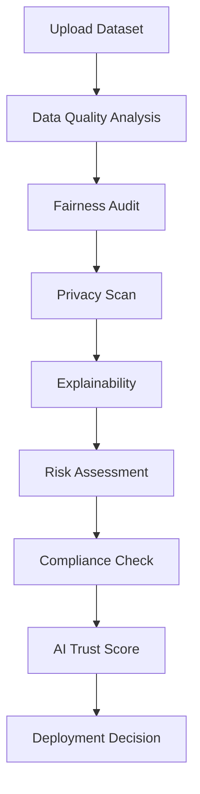

# AI Trust Pipeline

This repository now includes an AI trust pipeline diagram and helper files to run a minimal smoke test.



---

# ai-guardian-os
AI_Guardian_OS/
│
├── app.py
├── requirements.txt
├── README.md
├── .gitignore
├── .env.example
│
├── assets/
│   ├── logo.png
│   ├── banner.png
│   └── styles.css
│
├── pages/
│   ├── 1_Dashboard.py
│   ├── 2_Upload.py
│   ├── 3_Fairness.py
│   ├── 4_Privacy.py
│   ├── 5_Explainability.py
│   ├── 6_Compliance.py
│   ├── 7_Monitoring.py
│   ├── 8_AI_Copilot.py
│   ├── 9_Certificate.py
│   └── 10_Settings.py
│
├── ai/
├── database/
├── reports/
├── uploads/
├── utils/
└── tests/

## Quickstart (Docker)

Build the Docker image and run the app locally:

```bash
docker build -t ai-guardian-os:latest .
docker run --rm -p 8501:8501 ai-guardian-os:latest
```

Visit http://localhost:8501 to view the Streamlit app.

## CI

A GitHub Actions workflow is included at `.github/workflows/ci.yml` which installs requirements and performs a syntax/compile check.

## Reproducible training

Use the training and sweep scripts to reproduce experiments:

```bash
# Train on sample dataset (writes models and metrics to results/)
python3 scripts/train.py --data data/sample.csv --target target --val-size 0.1 --test-size 0.2

# Run a hyperparameter sweep
python3 scripts/sweep.py --data data/sample.csv --target target --trials 10 --results-out results

# Show leaderboard
python3 scripts/leaderboard.py --results results
```

## MLflow

The project logs experiments to MLflow under the experiment name `ai_guardian_experiments`. To view the MLflow UI locally:

```bash
# start the MLflow server (runs on port 5000)
mlflow ui --port 5000

# then open http://localhost:5000 in your browser
```

You can also view runs from the Streamlit `Train / Sweep` page using the `Show MLflow Runs` button.

### Model Registry and Promotion

The repository includes a helper to register and promote models into the MLflow Model Registry:

```bash
# Promote a run artifact to the registry and move it to Staging
python3 scripts/mlflow_promote.py --run-id <RUN_ID> --model-name my_model --stage Staging
```

CI will run a small MLflow smoke test on each push: it starts an `mlflow server` backed by a local sqlite DB, logs a toy model, registers a model version and promotes it to `Staging` to validate r[...]